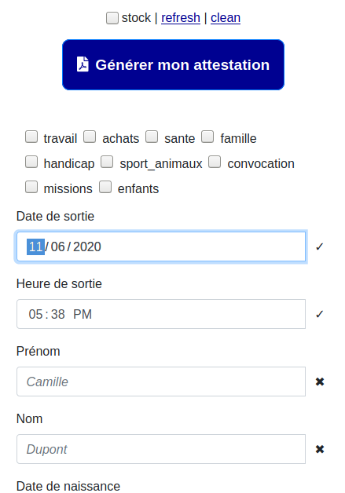

# Générateur de certificat de déplacement version compact



## Modifications (Quick & Dirty)

- Ajoute patch localstorage pour enregistrer les données dans le navigateur
- Réordonne les champs pour avoir le bouton de génération et les motifs en premier
- Remplace tous les labels des motifs par leur code respectif

## Docs

Pour installer toutes les dépendances :

```console
npm i
```

Pour développer et tester avec rechargement automatique :

```console
npm start
```

(Visitez http://localhost:1234)

Générer et tester le code de production

```console
npm run build:dev
npx serve dist
```

(Visiter http://localhost:5000)

Le code à déployer est dans le dossier `dist`

## Crédits

Ce projet a été réalisé à partir d'un fork du dépôt [deplacement-covid-19-q4-2020](https://github.com/LAB-MI/attestation-deplacement-derogatoire-q4-2020) lui même fork de [deplacement-covid-19](https://github.com/LAB-MI/deplacement-covid-19) de lui-même réalisé à partir d'un fork du dépôt [covid-19-certificate](https://github.com/nesk/covid-19-certificate) de [Johann Pardanaud](https://github.com/nesk).

Les projets open source suivants ont été utilisés pour le développement de ce
service :

- [PDF-LIB](https://pdf-lib.js.org/)
- [qrcode](https://github.com/soldair/node-qrcode)
- [Bootstrap](https://getbootstrap.com/)
- [Font Awesome](https://fontawesome.com/license)

Le patch du [LocalStorage](https://github.com/tar-gezed/attestation-deplacement-derogatoire-q4-2020/tree/feature/store-and-autocomplete-data) est de [Quentin Dunand (tar-gezed)](https://github.com/tar-gezed)
